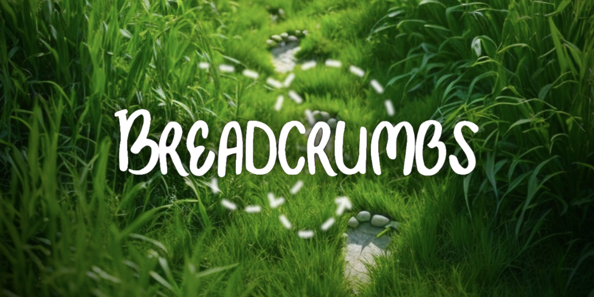
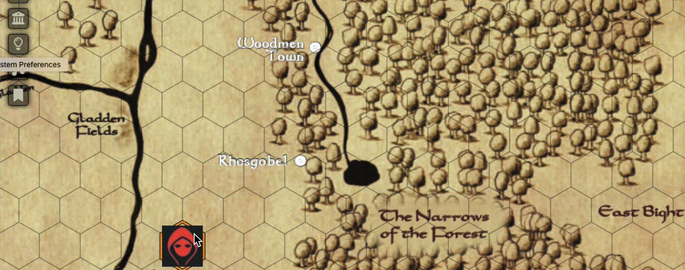

# foundry-vtt-breadcrumbs

## Summary
Foundry VTT Breadcrumbs adds configurable tile-based trails to the tokens of any actor that the GM desires. Breadcrumb images can be unique to scenes, actors, or individual tokens. Trails can be configured for length, style, and other properties both globally and per-scene.

# Configuration Options
## World Options
`Breadcrumbs Enabled` Enabled Breadcrumb usage across any configured scenes.

`Default Image` The image used for crumbs unless overridden by scene or actor settings.

`Default Tint` The tint image used for crumbs unless overridden by scene or actor settings.

`Default Scale` The scale used for crumbs unless overridden by scene or actor settings.

`Max Trail Length` The maximum number of crumbs in a given trail. Can be overriden at the scene level.

`Hidden` Breadcrumbs trails are only visible to the GM role.

## Scene Options
#### To set these options, use the included `breadcrumbsSceneConfig` macro to apply settings to the currently-viewed scene.

`Enable Breadcrumbs` Enables the use of Breadcrumbs on the scene.

`Override Actors` Prefer the scene's default Breadcrumbs settings over any available actor settings. Note that this does _not_ override individual token settings, which may be set explicitly. See 

`Breadcrumbs Image` The default image for crumbs in the scene.

`Tint` The default tint for crumbs in the scene.

`Scale` The default scale for crumbs in the scene.

`Trail Length` A scene-specific override for the maxmimum trail length specified in [World Options](#world-options).

## Actor Options
#### To set these options, use the included `breadcrumbsActorConfig` macro with a token or multiple tokens selected.

`Enable Breadcrumbs` Enable Breadcrumbs for this actor or token.

`Apply to Actor` If left unchecked, the configuration options will be set on the token or tokens directly, bypassing any scene-specific configurations. If checked, the settings will propogate to the actor, becoming the default for all of that actor's newly-placed tokens and being subject to the `Override Actors` setting in [Scene Options](#scene-options).

`Breadcrumbs Image` The token or actor's default Breadcrumbs image.

`Image Tint` The token or actor's default Breadcrumbs tint.

`Image Scale` The token or actor's default Breadcrumbs scale. If this is not specified (i.e. '1') crumbs will scale along with the parent token's scale.

`Alternate Sides` Mirror every-other Breadcrumb created. This allows for a 'right-foot, left-foot' pattern where each Breadcrumb is a single step in the token's 'stride.' This is especially effective for giant footprints etc where each grid space moved through represents only a portion of the creature's overall token area.

`Hidden` An actor-specific override for the Hidden setting in [World Options](#world-options).

# Media
